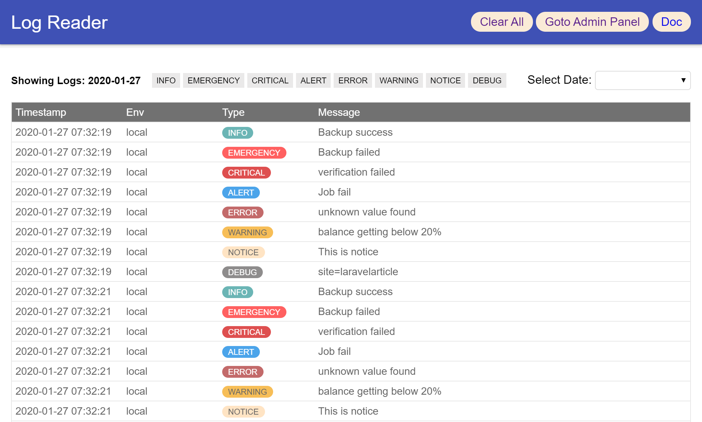

<h1 align="center">Laravel Log Reader</h1>

    
    
     
    
    

A simple and beautiful laravel log reader

## Documentation
Get full documentation of [Laravel Log Reader](https://laravelarticle.com/laravel-log-reader)
